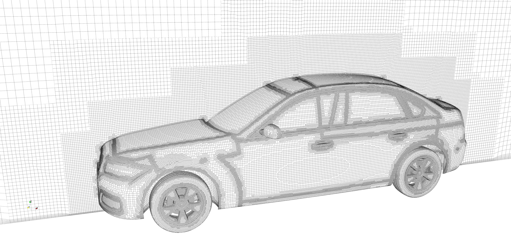
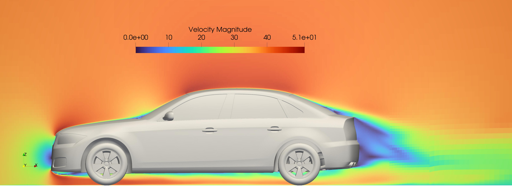
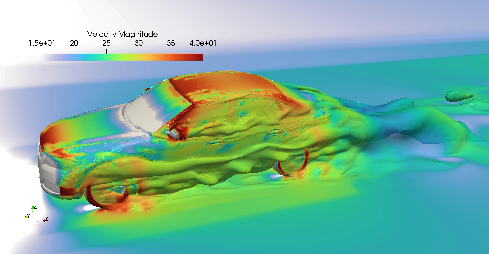
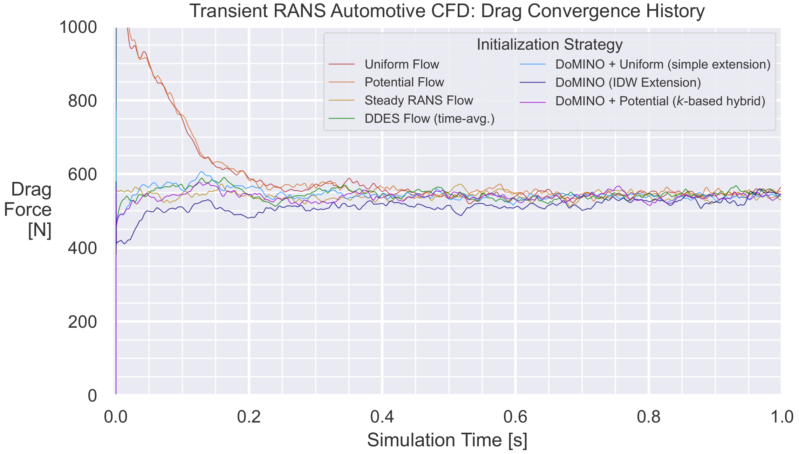

# Hybrid Initialization Reference Workflow for Transient Automotive Aerodynamics

This reference workflow demonstrates NVIDIA's hybrid initialization approach for
accelerating transient automotive aerodynamics simulations using OpenFOAM-based
solvers. The workflow combines a potential flow solution with a machine learning
surrogate initialization from the DoMINO NVIDIA Inference Microservice (NIM).

## Overview

The workflow architecture is shown below. This repository contains the
components in the "OpenFOAM + Python Docker Container" box, along with
instructions for launching the DoMINO NIM Docker Container and an example
OpenFOAM-based case:


## Prerequisites

- Docker and NVIDIA Container Toolkit installed
- NVIDIA NGC API key (for downloading DoMINO NIM checkpoints)
- Sufficient disk space (~50GB for the baseline case)

## Running the Workflow

To run this workflow using the provided template within this directory:

1. Launch the DoMINO NIM container on your local machine:
   - Follow the instructions
     [here](https://catalog.ngc.nvidia.com/orgs/nim/teams/nvidia/containers/domino-automotive-aero)
   - Or use the quick-launch script [within this
     repository](../../physicsnemo/cfd/inference/launch_local_domino_nim.sh)
   Note: In either case, you will need a valid NVIDIA NGC API key to download
   checkpoint files from the NGC container registry. To do this, follow the
   instructions [here](https://org.ngc.nvidia.com/setup/api-keys) and set the
   `NGC_API_KEY` environment variable.

2. Launch the OpenFOAM + Python Docker container, and install `physicsnemo-cfd`:
   - First-time users may need to build the container locally (see [Building the
     Docker Container](#building-the-docker-container) section)
   - Execute the [`openfoam_interactive.sh`](openfoam_interactive.sh) script.
     For the `physicsnemo-cfd` repository to be included in the container,
     launch this script from the repository's top-level directory. This will
     start an interactive shell into a container that has the OpenFOAM + Python
     environment installed.

   Once inside the container, and while at the repository root (mapped to
   `/workspace/` if the provided script is launched from the repository root),
   use this command to install `physicsnemo-cfd` and its dependencies: its
   dependencies:

   ```bash
   pip install . --extra-index-url=https://pypi.nvidia.com
   ```

   Complete example (run from this README's directory):

   ```bash
   cd ../../
   ./workflows/hybrid_initialization_example/openfoam_interactive.sh
   # Following commands run inside the container
   pip install . --extra-index-url=https://pypi.nvidia.com
   ```

   - Note: If you are running this workflow in an environment with both Python
     3.10+ and OpenFOAM v2206 installed, you have the option of skipping the
     container step and instead running the workflow directly from your local
     machine.

3. Run the workflow by executing the [`run.sh`](run.sh) script. The script
   performs the following steps:
    1. Prepares DoMINO assets (geometry and predicted flow field)
    2. Generates the computational mesh
    3. Computes the potential flow solution
    4. Creates the hybrid initialization
    5. Runs the transient CFD simulation
    6. Generates VTK output for visualization

    **Notes and Troubleshooting**:
    - If at any time you need to reset the directory to its original state, you
      can run the [`clean.sh`](clean.sh) script.
    - If unexpected errors occur, check the various `log.*` files produced at
      each step of the workflow to diagnose the root cause. Note that, to
      maintain readability, the [`run.sh`](run.sh) script does not include logic
      to halt subsequent commands on errors in any given step, so finding the
      first error in the logs will be most useful for troubleshooting.
    - If the goal is merely to verify functionality of this workflow, rather
      than to obtain converged results: the most time-consuming step of this
      workflow, which is the unsteady transient CFD solve using OpenFOAM
      (`pimpleFoam`), may be optionally halted early with CTRL+C after the first
      few time steps. The script will then gracefully continue onto the
      post-processing step.
    - Note that the script will automatically parallelize the meshing process,
      potential flow solve, and transient CFD solve across all available CPU
      cores on the node.

4. After the workflow has finished, you can inspect the results in the
   [`VTK/`](./VTK/) directory. In addition, a `postProcessing/` directory is
   created in the case directory at runtime, which, among other outputs,
   contains a time-history of the drag force on the vehicle throughout the
   transient CFD solve. This can be used to assess the relative improvement in
   convergence speed that is enabled by the hybrid initialization, relative to a
   baseline uniform or potential flow initialization.

## Expected Results

### Mesh Generation

The workflow generates a high-quality mesh suitable for automotive aerodynamics:



### Hybrid Initialization

The initialization field combines potential flow and ML predictions:



### Final Flow Field

The transient simulation produces a detailed flow field:



### Performance Metrics

The hybrid initialization significantly accelerates convergence compared to
traditional methods:



The workflow in this folder (without modification) should roughly replicate the
line labeled "DoMINO + Potential (k-based hybrid)" in the chart above. Results
will not be identical, due to the chaotic nature of turbulent structures in the
vehicle wake, but the general trend should be similar.

For detailed performance analysis and methodology, please refer to our
publication:

- Peter Sharpe, Rishikesh Ranade, Kaustubh Tangsali, Mohammad Amin Nabian, Ram
  Cherukuri, Sanjay Choudhry, ["Accelerating Transient CFD through Machine
  Learning-Based Flow Initialization"](https://arxiv.org/abs/2503.15766), 2025.

## Customizing the Workflow

### Modifying the Workflow for Different Physical Cases

The [`run.sh`](run.sh) script begins with a Python script,
`prepare_domino_assets.py`, which generates intermediate files in the
[`from_domino/`](./from_domino/) directory:

- `initialConditions`, a C++-like header file that contains constants for the
  inlet velocity, outlet pressure, and turbulence parameters. A template for
  this file format is included here; this could be modified for different
  OpenFOAM cases if desired, though the template includes important parameters
  for many external flow cases.
- `vehicle.stl` (140 MB for the baseline DrivAerML ID 4 case), the geometry of
  the vehicle. This is downloaded from a public HuggingFace repository.
- `predicted_flow.vtu` (38 GB for the baseline DrivAerML ID 4 case), which
  represents the DoMINO-predicted flow field. This is generated on-the-fly using
  a call to the DoMINO NIM. If you wish to directly modify the predicted flow
  field, note the format - this should be a VTK unstructured grid file with (at
  least) the following point data fields:
  - `UMeanTrimPred`, the predicted time-averaged velocity field.
  - `pMeanTrimPred`, the predicted time-averaged pressure field.
  - `TKEPred`, the predicted turbulent kinetic energy (k) field.
  - `nutMeanTrimPred`, the predicted turbulent viscosity field.

By modifying these inputs (either directly, or by modifying the
`prepare_domino_assets.py` script), the workflow can be adapted to different
cases.

### Modifying the Workflow for Different CFD Solvers

To run this workflow with a different CFD solver for the transient solve, two
modifications should be made:

- First, modify the
  [`make_hybrid_initialization.py`](make_hybrid_initialization.py) script to
  generate the potential flow solution using the new solver. Interfaces are
  provided for either VTU or OpenFOAM polyMesh directories as input; other
  formats may require third-party conversion tools. You will also need to modify
  the hybrid initialization write step to match the new solver's expected format
  for field data.
- Second, modify the [`run.sh`](run.sh) script to use the new solver for the
  transient CFD solve.

## Building the Docker Container

The first time that you run this workflow, you may need to build the Docker
container yourself (if you cannot access a container registry associated with
this repository). To check if this is needed, try to run the
[`openfoam_interactive.sh`](openfoam_interactive.sh) script. If you get an error
about the container not being found, you will need to build the container
yourself.

To build the Docker container yourself, first `cd` to the
[`container/`](./container/) directory, and then build the container with `make
container`. Upon successful completion, you should see a container titled
`openfoam-python` with tag `latest` when you run `docker images`.

Note that this image only contains OpenFOAM and Python, plus the underlying
dependencies for `physicsnemo-cfd`. It does not contain `physicsnemo-cfd`
pre-installed, which is intended to reduce the need to re-build the container
when `physicsnemo-cfd` is updated. It also does not contain the DoMINO
Automotive Aero NIM, which is [available
separately](https://catalog.ngc.nvidia.com/orgs/nim/teams/nvidia/containers/domino-automotive-aero).
